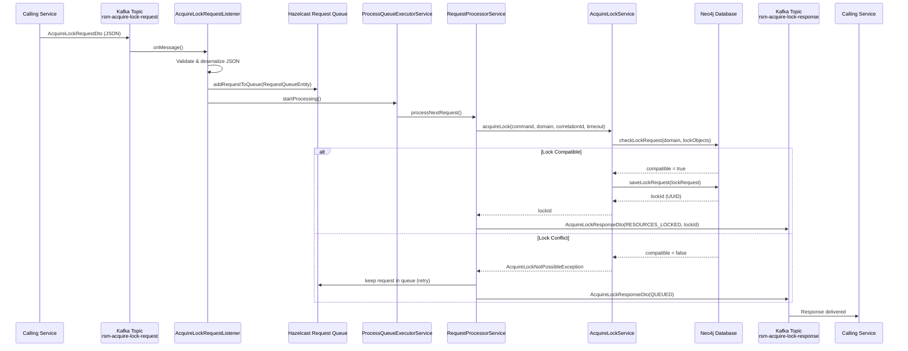
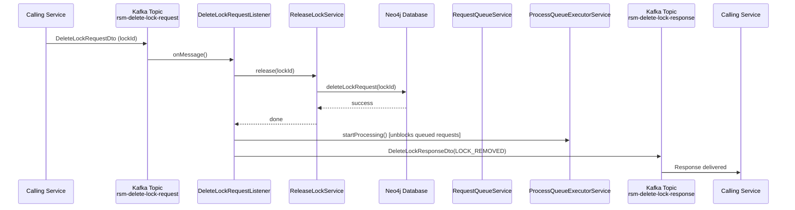
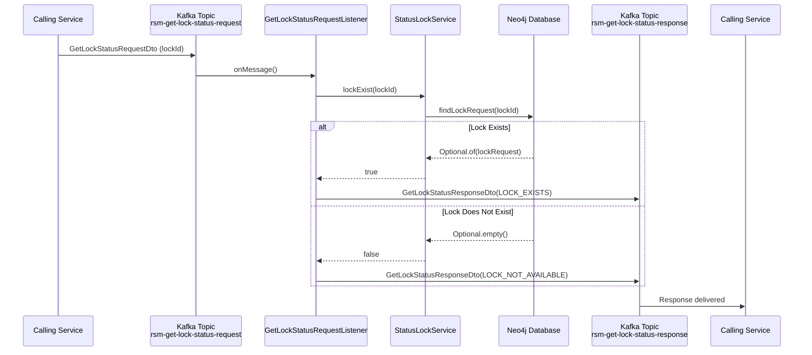
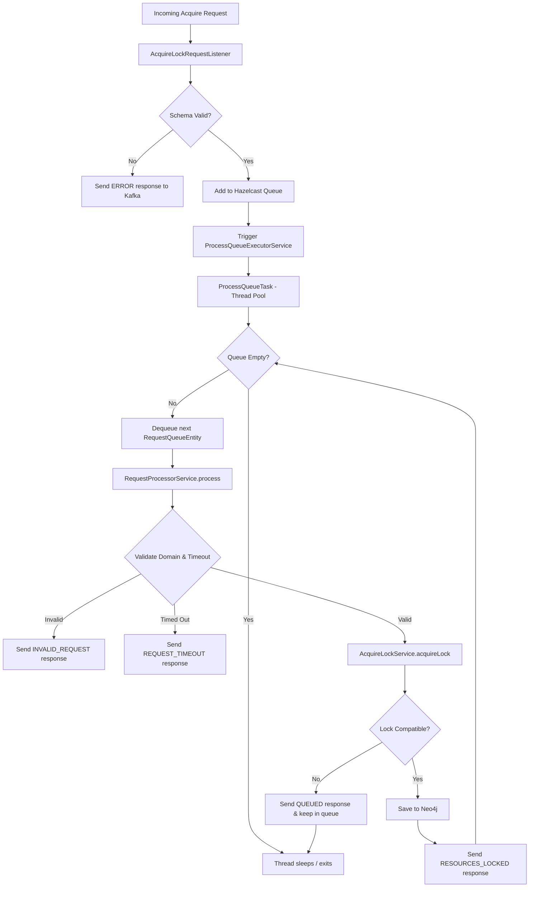

# Resource Manager Session — Multi-Module Spring Boot Application

A distributed resource-locking platform built with Spring Boot 3.5.2, Apache Kafka, Neo4j, and Hazelcast.  
It exposes three core operations over Kafka: **Acquire Lock**, **Delete Lock**, and **Get Lock Status**.

---

## Table of Contents

1. [Architecture Overview](#architecture-overview)
2. [Module Structure](#module-structure)
3. [End-to-End Workflow Diagrams](#end-to-end-workflow-diagrams)
   - [Acquire Lock](#acquire-lock-flow)
   - [Delete Lock](#delete-lock-flow)
   - [Get Lock Status](#get-lock-status-flow)
   - [Request Queue Processing](#request-queue-processing-flow)
4. [Prerequisites](#prerequisites)
5. [Build the Project](#build-the-project)
6. [Run the Application](#run-the-application)
7. [Configuration Reference](#configuration-reference)
8. [Kafka Topics](#kafka-topics)
9. [Running Tests](#running-tests)
10. [API / Actuator Endpoints](#api--actuator-endpoints)
11. [Docker Compose](#docker-compose)

---

## Architecture Overview

```
┌─────────────────────────────────────────────────────────────────┐
│                    resource-manager-session                      │
│                                                                  │
│  ┌──────────────┐   ┌──────────────┐   ┌──────────────────────┐ │
│  │ platform-    │   │ shared-kafka │   │ shared-neo4j         │ │
│  │ parent (BOM) │   │ (base kafka  │   │ (Neo4j utilities &   │ │
│  └──────────────┘   │  abstractions│   │  shared config)      │ │
│                     └──────────────┘   └──────────────────────┘ │
│  ┌──────────────┐                                                │
│  │ common-utils │                                                │
│  │ (shared util │                                                │
│  │  classes)    │                                                │
│  └──────────────┘                                                │
│  ┌────────────────────────────────────────────────────────────┐  │
│  │ resource-core  (Unified Resource Manager + Session Manager) │  │
│  │  Kafka Listeners → Hazelcast Queue → Neo4j Persistence      │  │
│  └────────────────────────────────────────────────────────────┘  │
└─────────────────────────────────────────────────────────────────┘
```

---

## Module Structure

The project contains **5 active modules**. Two placeholder modules (`session-core`, `shared-security`) were removed as they contained no source code.

### `platform-parent`
**Role:** Maven Bill of Materials (BOM) and build configuration parent.

Every other module inherits from this. It centralises:
- Spring Boot version (`3.5.2`)
- All third-party dependency versions (Neo4j, Kafka, Lombok, MapStruct, Cucumber, Protobuf, etc.)
- Maven compiler plugin configuration (Java 17 source/target)
- Spring Boot Maven plugin definition

Without this module, each child would need to independently manage version alignment — this prevents version conflicts across the project.

---

### `shared-kafka`
**Role:** Reusable Kafka infrastructure — base listener and producer abstractions.

Provides:
- `BaseListener<T>` — abstract Kafka listener that handles JSON deserialization, schema validation (via `networknt/json-schema-validator`), and correlation ID propagation via message headers
- `BaseProducer<T>` — abstract Kafka producer wrapping `KafkaTemplate` with topic and client-id configuration
- `KafkaCommonConfig` — shared Kafka consumer/producer Spring configuration imported by applications
- `ValidationException` — typed exception carrying JSON schema validation errors

Both `resource-core`'s Resource Manager and Session Manager Kafka listeners/producers extend these base classes. Centralising here avoids duplicating Kafka plumbing in each feature.

---

### `shared-neo4j`
**Role:** Shared Neo4j utilities and configuration used across modules.

Provides Neo4j-related helper classes and configuration that can be reused without coupling modules to a single application context. Keeps Neo4j setup concerns out of `resource-core`'s business logic.

---

### `common-utils`
**Role:** General-purpose utility classes shared across the application.

Provides:
- `SessionEntityUtil` — helpers for converting `TripletEntity` to Hazelcast map keys and checking session timeout
- `HazelcastServiceUtility` — Hazelcast map access utilities
- `LoggingUtils` / `MDCConstants` — MDC logging constants and helpers
- `Constants` — application-wide constant definitions
- `common/` package — cross-cutting annotations and base types (`@UseCase`, `@WebAdapter`, `SelfValidating<T>`, `Auditable`, `AuditableType`) that enforce hexagonal-architecture conventions

Depended on by `resource-core`. Keeping these here prevents code duplication and maintains a consistent pattern for domain validation and annotation-driven architecture.

---

### `resource-core`
**Role:** The single runnable Spring Boot application — hosts both the **Resource Manager** and **Session Manager** domains.

This is the main deliverable. It contains:

**Resource Manager** (`com.kpn.ndsal.resourcemanager`)
- Kafka listeners for `Acquire Lock`, `Delete Lock`, and `Get Lock Status` requests
- Hazelcast-backed request queue for handling lock contention (queues conflicting requests for retry)
- Neo4j persistence for lock state (`LockRequest`, `LockObject` nodes)
- Scheduled cleanup of expired locks and timed-out queue entries
- `NewTopic` beans that auto-create all 6 Resource Manager Kafka topics on startup

**Session Manager** (`com.kpn.ndsal.sessionmanager`)
- Kafka listeners for `Acquire Session` and `Release Session` requests
- Hazelcast-backed session map for in-memory session state
- Domain-based routing via `DomainsSessionConfig` (loaded from `domain-config.yml`)
- Neo4j persistence for session entities
- `NewTopic` beans that auto-create all 4 Session Manager Kafka topics on startup

**Shared infrastructure in this module:**
- `HazelcastConfigurator` / `HazelcastConfig` — two named Hazelcast instances (`resourceManagerHazelcastInstance`, `sessionManagerHazelcastInstance`) running embedded
- `application.yml` — single unified configuration for both domains
- Spring Boot main class with `@ComponentScan` covering both `com.kpn` package trees

---

## End-to-End Workflow Diagrams

### Acquire Lock Flow



---

### Delete Lock Flow



---

### Get Lock Status Flow



---

### Request Queue Processing Flow



---

## Prerequisites

| Requirement | Minimum Version | Notes |
|-------------|-----------------|-------|
| Java (JDK)  | 17              | LTS — must be on `JAVA_HOME` |
| Maven       | 3.9+            | Or use `./mvnw` wrapper |
| Apache Kafka | 3.x            | Running on `localhost:8082` |
| Neo4j        | 5.x            | Running on `bolt://localhost:7474` |
| Hazelcast    | Embedded        | No external instance required |
| Docker (optional) | 20+       | For `docker-compose` setup |

---

## Build the Project

### Build all modules (from the root)

```powershell
cd resource-manager-session
./mvnw clean install -DskipTests
```

### Build a specific module

```powershell
cd resource-manager-session/resource-core
./mvnw clean install -DskipTests
```

---

## Run the Application

### Option 1 — Maven Spring Boot plugin (development)

**resource-core** (Resource Manager):

```powershell
cd resource-manager-session/resource-core
./mvnw spring-boot:run
```

### Option 2 — Run the fat JAR

```powershell
cd resource-manager-session
./mvnw clean package -DskipTests
java -jar resource-core/target/resource-core-1.0.0-SNAPSHOT.jar
```

### Option 3 — Docker Compose (full stack)

```powershell
cd resource-manager-session
docker-compose up -d
```

This starts Kafka, Neo4j, and the application together.  
See [`docker/`](docker/) for individual service override files.

---

## Configuration Reference

Configuration file: `resource-core/src/main/resources/application.yml`

| Property | Default | Description |
|----------|---------|-------------|
| `spring.neo4j.uri` | `bolt://localhost:7687` | Neo4j Bolt URL |
| `spring.neo4j.authentication.username` | `neo4j` | Neo4j username |
| `spring.neo4j.authentication.password` | `password` | Neo4j password |
| `spring.kafka.bootstrap-servers` | `localhost:9092` | Kafka broker(s) |
| `spring.kafka.consumer.group-id` | `test-consumer-group` | Kafka consumer group |
| `lock.defaultTimeout.value` | `1` | Lock default expiry value |
| `lock.defaultTimeout.unit` | `day` | Lock default expiry unit |
| `requestQueue.timeout.value` | `1` | Queue request timeout value |
| `requestQueue.timeout.unit` | `hour` | Queue request timeout unit |
| `lock.cleanerCronExpression` | `0 */1 * * * ?` | Lock cleanup schedule (every minute) |
| `management.endpoints.web.base-path` | `/management` | Actuator base path |

### Override with environment variables

```powershell
java -jar resource-core/target/resource-core-1.0.0-SNAPSHOT.jar `
  --spring.neo4j.uri=bolt://my-neo4j:7687 `
  --spring.kafka.bootstrap-servers=my-kafka:9092
```

### Spring Profiles

| Profile | Purpose |
|---------|---------|
| *(default)* | Local development, embedded defaults |
| `dev` | Development overrides |
| `n4g` | Neo4j-specific connection overrides |

Activate with: `--spring.profiles.active=dev`

---

## Kafka Topics

### Consumer Topics (inbound requests to Resource Manager)

| Topic | Purpose | Payload |
|-------|---------|---------|
| `rsm-acquire-lock-request` | Request to acquire a lock on resources | `AcquireLockRequestDto` |
| `rsm-delete-lock-request`  | Request to release an existing lock | `DeleteLockRequestDto` |
| `rsm-get-lock-status-request` | Query whether a lock exists | `GetLockStatusRequestDto` |

### Producer Topics (outbound responses from Resource Manager)

| Topic | Purpose | Payload |
|-------|---------|---------|
| `rsm-acquire-lock-response` | Result of an acquire lock request | `AcquireLockResponseDto` |
| `rsm-delete-lock-response`  | Result of a delete lock request | `DeleteLockResponseDto` |
| `rsm-get-lock-status-response` | Lock existence result | `GetLockStatusResponseDto` |

### Response Status Values

**AcquireLockResponseDto.AcquireStatus**

| Status | Meaning |
|--------|---------|
| `RESOURCES_LOCKED` | Lock acquired successfully |
| `QUEUED` | Lock request enqueued (conflicting lock active) |
| `INVALID_REQUEST` | Request failed schema/domain validation |
| `REQUEST_TIMEOUT` | Request exceeded queue timeout |
| `ERROR` | Internal processing error |

**DeleteLockResponseDto**

| Status | Meaning |
|--------|---------|
| `LOCK_REMOVED` | Lock successfully deleted |

**GetLockStatusResponseDto**

| Status | Meaning |
|--------|---------|
| `LOCK_EXISTS` | A lock with the given ID is present |
| `LOCK_NOT_AVAILABLE` | No lock found for the given ID |

---

## Running Tests

Tests use an **embedded Kafka broker** and **embedded Neo4j** via Testcontainers — no external infrastructure required.

### Run all tests

```powershell
cd resource-manager-session
./mvnw clean test
```

### Run tests for a specific module

```powershell
cd resource-manager-session/resource-core
./mvnw clean test
```

### Run only Cucumber BDD tests (tagged `@locking`)

```powershell
cd resource-manager-session/resource-core
./mvnw test -Dcucumber.filter.tags="@locking"
```

### Test Reports

After running tests, reports are generated at:

```
resource-core/target/cucumber-reports/Cucumber.html   ← HTML report (open in browser)
resource-core/target/cucumber-reports/Cucumber.json   ← JSON report
resource-core/target/cucumber-reports/Cucumber.xml    ← JUnit XML report
```

### BDD Test Scenarios

Located in `resource-core/src/test/resources/features/`:

| Feature File | Scenarios |
|--------------|-----------|
| `acquire_lock.feature` | Successful locking, queuing, priority handling, timeout handling |
| `delete_lock.feature` | Remove an existing lock |
| `get_lock_status.feature` | Check lock existence before/after acquire and delete |

#### Example: Acquire Lock Scenarios

| Input | Expected Response |
|-------|-----------------|
| `NODE#nl-pbl-cpe-01#false` (shared) + same resource again | `RESOURCES_LOCKED` (duplicate shared allowed) |
| `NODE#nl-pbl-cpe-01#true` then `NODE#nl-pbl-cpe-02#true` | `RESOURCES_LOCKED` (different nodes, both exclusive) |
| `NODE#nl-pbl-cpe-01#true` then same with shared | `QUEUED` (exclusive blocks shared) |

Lock resource format: `TYPE#NAME#isExclusive`  
Examples: `NODE#nl-pbl-cpe-01#false`, `PORT#nl-pbl-cpe-01:1/1/2#true`, `EAS#EAS000001#false`

---

## API / Actuator Endpoints

Once the application is running on port `8080`:

| Endpoint | Description |
|----------|-------------|
| `GET /management/health` | Health check |
| `GET /management/info` | Application info |
| `GET /management/metrics` | Micrometer metrics |
| `GET /management/prometheus` | Prometheus metrics scrape endpoint |
| `GET /swagger-ui.html` | Swagger UI (API documentation) |
| `GET /v3/api-docs` | OpenAPI 3 spec (JSON) |

---

## Docker Compose

Full stack (Kafka + Neo4j + app):

```powershell
cd resource-manager-session
docker-compose up -d
```

Individual service files in `docker/`:

| File | Purpose |
|------|---------|
| `docker/app-resource-manager.yml` | Resource Manager application service definition |
| `docker/app-session-manager.yml` | Session Manager application service definition |
| `docker/neo4j.yml` | Neo4j database |
| `docker/kafka.yml` | Kafka broker + Zookeeper + AKHQ UI |
| `docker/docker-compose-pipeline.yml` | CI/CD pipeline compose |

Stop and clean up:

```powershell
docker-compose down -v
```

---

## Lock Data Model

```
LockRequest
├── id          : UUID
├── domain      : String  (e.g. "BCPE")
├── correlationId : String
├── created     : LocalDateTime
├── timesOutAt  : LocalDateTime
├── released    : boolean
└── lockObjects : List<LockObject>
         ├── id       : UUID
         ├── name     : String  (e.g. "nl-pbl-cpe-01")
         ├── type     : String  (NODE | PORT | EAS)
         └── lockType : SHARED | EXCLUSIVE
```

Lock compatibility rules:
- **SHARED + SHARED** on the same resource → **allowed**
- **EXCLUSIVE + any** on the same resource → **blocked** (queued)
- **Different resources** always → **allowed**
