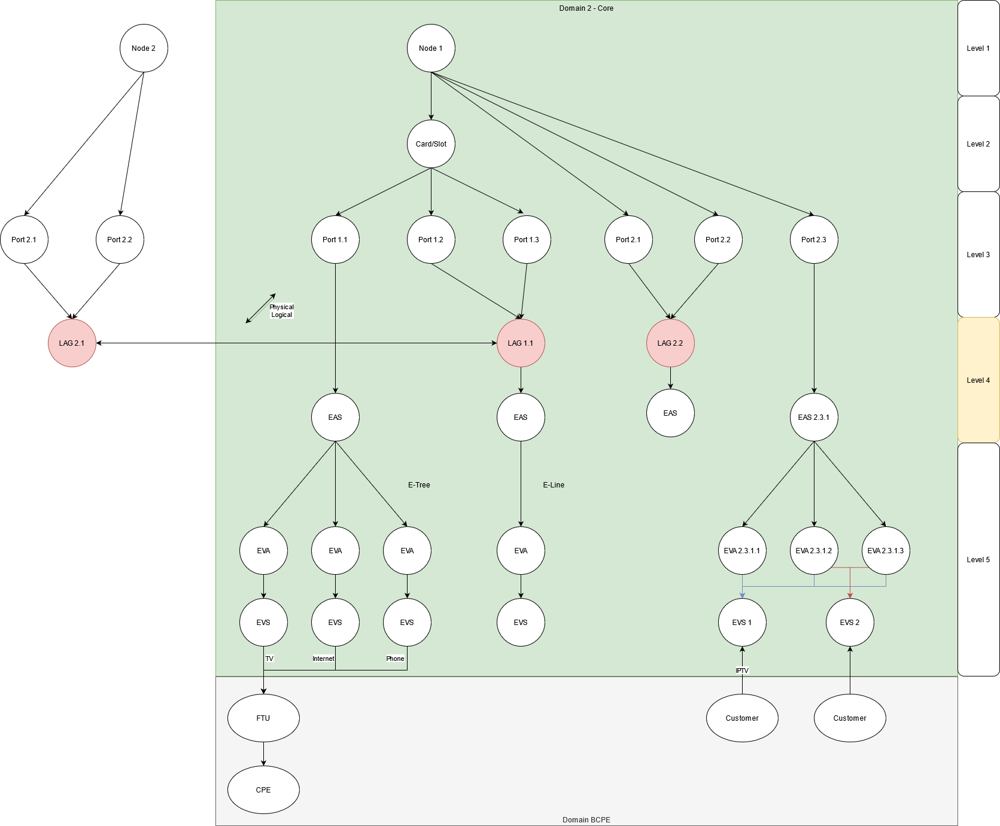

[[section-solution-strategy]]
== Solution Strategy

[role="help"]
****
.Contents
A short summary and explanation of the fundamental decisions and solution strategies, that shape the system's architecture. These include

* technology decisions
* decisions about the top-level decomposition of the system, e.g. usage of an architectural pattern or design pattern
* decisions on how to achieve key quality goals
* relevant organizational decisions, e.g. selecting a development process or delegating certain tasks to third parties.

.Motivation
These decisions form the cornerstones for your architecture. They are the basis for many other detailed decisions or implementation rules.

.Form
Keep the explanation of these key decisions short.

Motivate what you have decided and why you decided that way,
based upon your problem statement, the quality goals and key constraints.
Refer to details in the following sections.
****

=== Technology decisions

==== Locking algorithm

.Network Graph Example

* by default, all leaf nodes will receive exclusive lock
* all exclusive locks on level 4 will be applied to level 3 nodes
* the rest of the tree up to the root will get shared lock
* shared lock on a node prevents it of being promoted to exclusive lock
* request can contain instructions to explicitly lock certain nodes

    EXAMPLE: when Service Manager needs to create a TAG, exclusive lock should to be put on EVA and EVS. EAS will get shared lock. RM will receive explicit instructions to do this.

    EXAMPLE: for untagged configuration, Service Manager will request to lock only EAS.

* all nodes below explicitly locked one should be also exclusively locked

    NOTE: I have doubts we should track this. Access to these nodeswill be blocked by shared lock on parent node

* all nodes above leaf should receive shared lock, with some exceptions
** All level 4 nodes will block their parents with exclusive lock
** there is explicit instructions to put exclusive lock

[red]*TODO* create locking state machine representation

==== API

===== Request a lock

.kafka messages to acquire locks on resources
[source,http,options="nowrap"]
----

Request:

{
  "domain": "BCPE",
  "timeout": {
    "value": 1,
    "unit": "hour"
  },
  "priority": "MEDIUM",
  "lockGroups": [
    {
      "lockObjects":
      [
        {
          "type": "NODE",
          "id": "nl-pbl-cpe-01"
        },
        {
          "type": "PORT",
          "id": "nl-pbl-cpe-01:1/1/2"
        },
        {
          "type": "EAS",
          "id": "EAS000002",
          "force": "X"
        },
        {
          "type": "EVA",
          "id": "EVA000001"
        },
        {
          "type": "EVA",
          "id": "EVA000002"
        },
        {
          "type": "EVA",
          "id": "EVA000002"
        }
      ]
    }
  ]
}

Response:

{
  "lockId": "dcd890b3-904d-4ac4-a3b3-f90c6822324e"
}

----

===== Release lock

.kafka messages to release locks
[source,http,options="nowrap"]
----

Request:

{
  "lockId": "dcd890b3-904d-4ac4-a3b3-f90c6822324e"
}

Response:

{
  "deleteStatus": "LOCK_REMOVED"
}

----

[red]*TODO:*

Resource graph can be configured using GraphViz's DOT language. See website for more information link:https://graphviz.org/[GraphViz]
