[[section-design-decisions]]
== Design Decisions

[%collapsible]
[role="help"]
****
.Contents
Important, expensive, large scale or risky architecture decisions including rationals. With "decisions" we mean selecting one alternative based on given criteria.

Please use your judgement to decide whether an architectural decision should be documented here in this central section or whether you better document it locally (e.g. within the white box template of one building block).

Avoid redundancy. Refer to section 4, where you already captured the most important decisions of your architecture.

.Motivation
Stakeholders of your system should be able to comprehend and retrace your decisions.

.Form
Various options:

* List or table, ordered by importance and consequences or:
* more detailed in form of separate sections per decision
* ADR (architecture decision record) for every important decision
****

=== Architecture Decision Records

.Architecture Decision Records
[options="header",cols="1,5,2"]
|===
| ID
| Title
| Status  

| 001
| Using in-memory locking tree
| proposed

| 002
| Using graph database
| superseded

| 003
| General architecture
| proposed

| 004
| Core Locking Algorithm
| proposed

//| <n>
//| <title>
//| <proposed, accepted, rejected, deprecated, superseded>
|===

---

==== ADR [001] - Using in-memory locking tree

- in-memory locking graph
- caching as synchronization mechanism between instances
- persistence
- reliability mechanisms

===== Context

The core of the system will be called CHLA and will implement efficient locking mechanisms for hierarchical data structures. Algorithm is based on building a graph of locked resources. Locking algorithm will be traversing a graph and checking if it is possible to exclusively lock nodes.

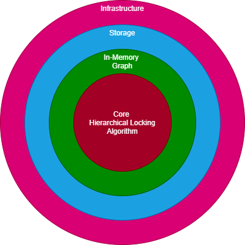

Phase 2 should add extra reliability to the system. In order to make decision, which reliability factor suits best for our solution, we can use CAP theorem. CAP theorem is fundamental part of distributed system. It describes trade-offs we need to make when designing full-tolerant systems.

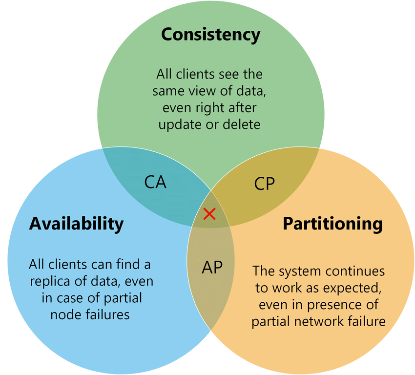

*Consistency*

At this moment I'm thinking about applying exclusive access to graph by implementing distributed lock. Such strict consistency mechanism should give more possibilities for Availability and Fault-Tolerance.

In order to decide how efficient exclusive access mechanism can be or not be, we need to have benchmarking for CHLA.

*Availability*

Availability can be providing by running multiple instances or the service and using single MASTER and multiple REPLICAs schema. Application context section provides some thought about implementation of this feature.

*Partitioning*

It needs to be decided if partitioning is necessary. Key factor here - size of graph.

====== Application Context

All distributed systems start as single node system. *Phase I* is to build stable component with reliable locking algorithm for resources. Key point here is that, when moving from single node to fully distributed functionality, each node is still doing the same. That is why it is crucially important to have stable core functionality.

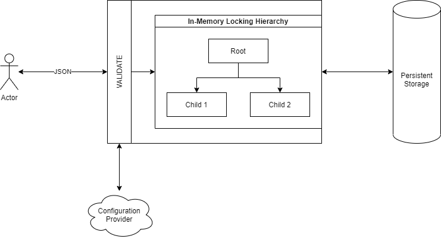

*Phase II* will add new infrastructure feature with added possibilities to scale and make solution fault-tolerant.

*Apache Helix* is a solution that allows to build stable systems that fulfil the requirements of desired state. Core concept of Helix is ability to define state machine. State machine defines the behaviour of the system at whole, e.g. who is master node, who is replica node, how behaviour is changed when exception happens, how and when transition should happen when promotion form Replica to Master is necessary. In other words, Helix is doing all heavy lifting for our distributed system by processing feedback loop  making sure that desired state of the system and ideal state are equal.

Helix Controller is responsible for all these core concept. Another important part of the system is Helix Agent, the library or agent that should be part of a client and provides added functionality, like determining who is the Master, what is the state of the system, initialization, etc.

ZooKeeper is a central place of our distributed system. ZooKeeper takes care that state will be persistent and durable. State is very important in case we don't want to have single point of failure.

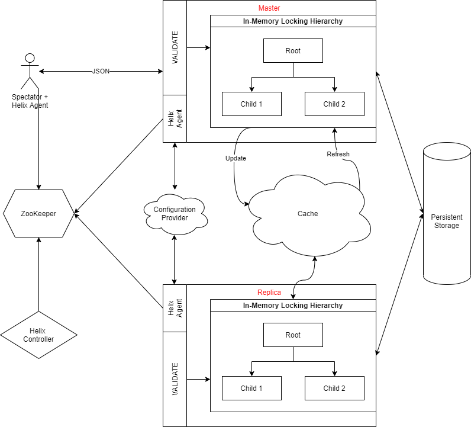

More information about Apache Helix, including scenarios and examples, can be found on link:https://helix.apache.org/[website].

link:https://helix.apache.org/1.0.2-docs/Tutorial.html[Helix Tutorial]

====== Application Start-up logic

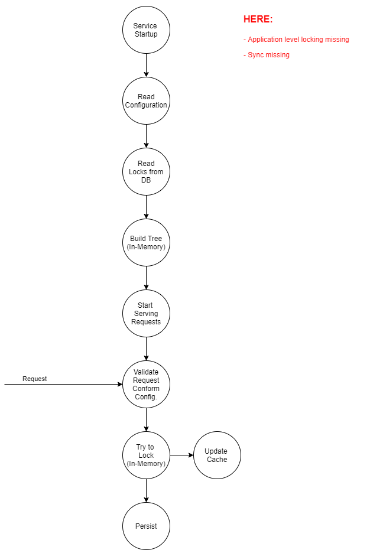

====== Locking strategy

Locks will always be acquired from the top to the bottom as in that way we can prevent a so-called *Race condition* to occur.

[red]*TODO:* optimistic or pessimistic locking?

*Exclusive lock (X)*

    This lock type, when imposed, will ensure that a node will be reserved exclusively for the transaction that imposed the exclusive lock, as long as the transaction holds the lock.
    An exclusive lock can be imposed to a node if there is no other shared lock imposed already on the target. This practically means that only one exclusive lock can be imposed to node, and once imposed no other lock can be imposed on locked resources.

*Shared lock (S)*

    This lock type, when imposed, will reserve a page or row to be available only for reading, which means that any other transaction will be prevented to modify the locked record as long as the lock is active. However, a shared lock can be imposed by several transactions at the same time over the same page or row and in that way several transactions can share the ability for data reading since the reading process itself will not affect anyhow the actual page or row data. In addition, a shared lock will allow write operations, but no DDL changes will be allowed

.Compatibility Matrix
[cols="1,1,1"]
|===
|Compatibility Matrix | S (Shared) | X (eXclusive)

|S | + | -
|X | - | -

|===

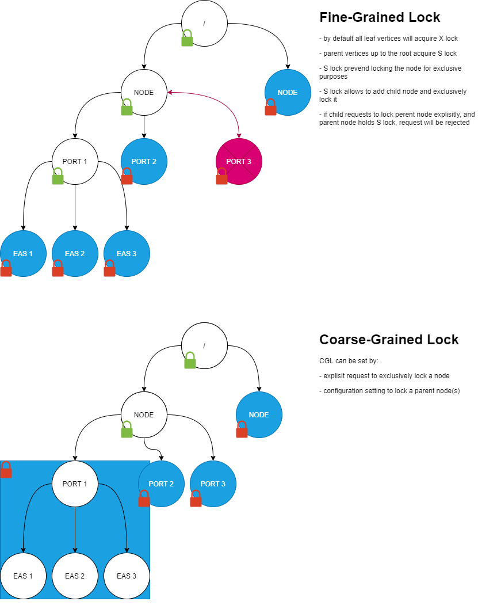

====== Frameworks and libraries

*JGraphT* (link:https://jgrapht.org/[JGraphT])

    Java library that provides reach operations set to manage graphs, export/import to DOT format, etc.

*GraphViz* (link:https://graphviz.org/[GraphViz])

    Provides standard language (DOT) for Graph visualization and description.

*SketchViz* (link:https://sketchviz.com/new[SketchViz])

    Online graph visualization tool that works with DOT format.

---

==== ADR [002] - Using graph database

Available Graph database can be used to replace In-Memory Graph and Storage layer. As an option we can consider Neo4J.

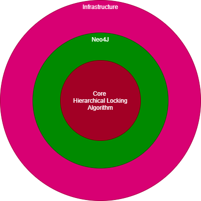

===== Context

In-memory graph, Persistence storage and HazelCast are not needed.

===== Decision
what is the change that we're actually proposing or doing.

===== Consequences
what becomes easier or more difficult to do because of this change.

---

==== ADR 003 - General architecture

This chapter offers an opinionated way of implementing a Resource Management as a solution in the hexagonal style with Java and Spring.

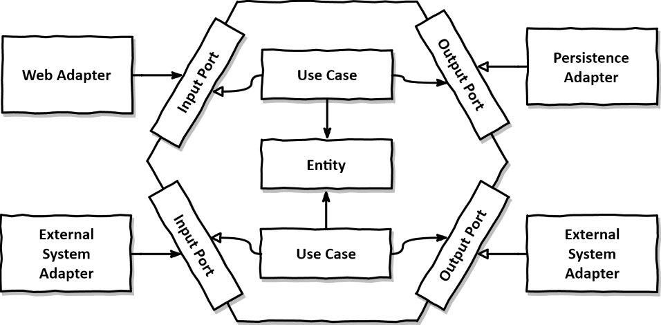

Extra readings and examples of hexagonal architecture:

link:https://reflectoring.io/spring-hexagonal/[Article - Hexagonal Architecture with Java and Spring]

link:https://reflectoring.io/book/[Book - Get Your Hands Dirty on Clean Architecture]

[options="header",cols="1,2"]
|===
| Date
| Status

| <date for the decision>
| <proposed, accepted, rejected, deprecated, superseded>
|===

===== Context
what is the issue that we're seeing that is motivating this decision or change.

===== Decision
what is the change that we're actually proposing or doing.

===== Consequences
what becomes easier or more difficult to do because of this change.

---

==== ADR 004 - Core Locking Algorithms (2 options)

Locking algorithm is based on compatibility between Shared Lock and Exclusive Lock that are set on resources. This compatibility is configured programmatically. *Configuration graph* provides resource schema and relationship between elements for particular domain. Besides this, configuration graph provides extra settings for node, such as:

1. force exclusive lock on parent node in case current node is exclusively locked
2. allow multiple parents for a node
3. allow multiple children for a node

.Compatibility Matrix
[cols="1,1,1"]
|===
|Compatibility Matrix | S (Shared) | X (eXclusive)

|S | + | -
|X | - | -
|===

Exclusiveness can be also forced by client's application by passing extra parameter in locking request.

Locking is performed in 4 steps:

1. Locking request is checked on validity and compatibility with domain schema. See section XX for more details.
2. Locking attempt is performed according to locking rules
3. Request is persisted
4. Data are replicated between multiple nodes

Un-Locking is performed in 4 steps:

1. Locked Resources are released
2. Request is persisted
3. Replicas are notified

*2 Locking approaches*:

1. In-Memory Graph
2. Flat structure in database

---
===== In-Memory Graph

1. *initial request*"

Please, see example #17.

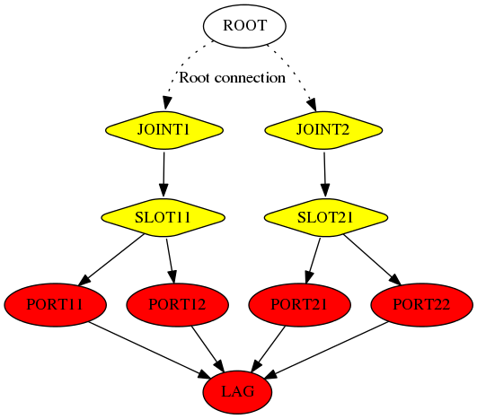

2. *consecutive request*". [red]*OK*

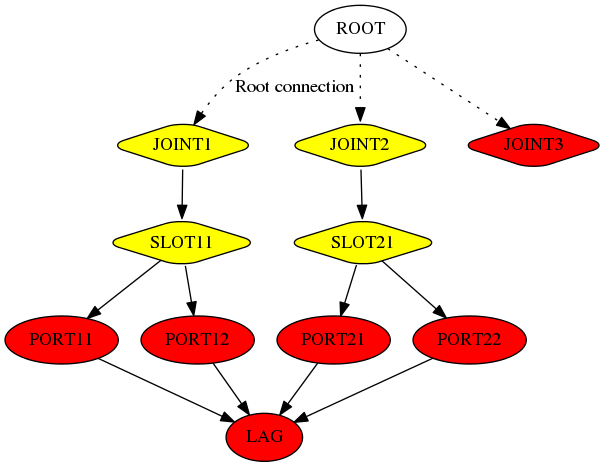

2. *consecutive request*". [red]*OK*

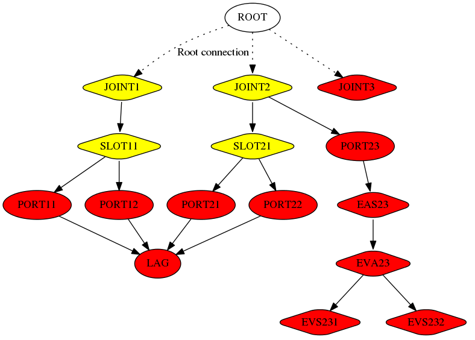

2. *consecutive request*". [red]*FAILED*

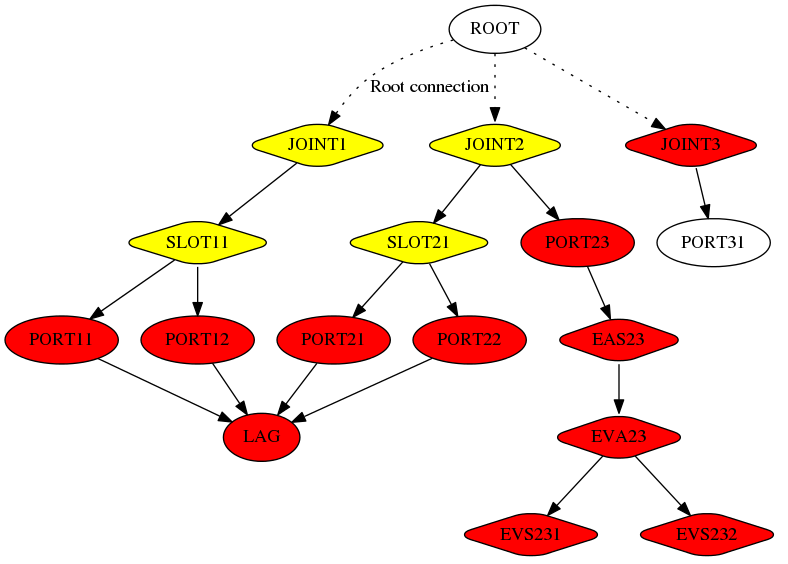

[plantuml, diagram-final-graph, png, align="center"]
----
@startuml
strict digraph G {

  JOINT1, JOINT2, SLOT11, SLOT21 [fillcolor=yellow, style="rounded, filled", shape=diamond];
  PORT11, PORT12, PORT21, PORT22, PORT23, LAG [fillcolor=red, style="filled"];
  JOINT3 [fillcolor=red, style="rounded, filled", shape=diamond];
  EAS23, EVA23, EVS231, EVS232 [fillcolor=red, style="rounded, filled", shape=diamond];

  PORT31 []

  ROOT -> JOINT1 [style=dotted label="Root connection"];
  ROOT -> JOINT2 [style=dotted];
  ROOT -> JOINT3 [style=dotted];

  JOINT1 -> SLOT11 [];
  SLOT11 -> PORT11;
  SLOT11 -> PORT12;
  PORT11 -> LAG;
  PORT12 -> LAG;

  JOINT2 -> SLOT21;
  SLOT21 -> PORT21;
  SLOT21 -> PORT22;
  PORT21 -> LAG;
  PORT22 -> LAG;

  JOINT2 -> PORT23 -> EAS23 -> EVA23;
  EVA23 -> EVS231;
  EVA23 -> EVS232;

  JOINT3 -> PORT31 []

}
@enduml
----

*Pro:*
1. Graph visually corresponds to the schema of physical resources layout

*Cons:*

1. Cumbersome intrinsic implementation
2. Multi-phase locking algorithm brings extra complexity
3. Nodes will be not immutable anymore - they need to hold information about request_id they belong to.
4. Unlocking mechanism

---

===== Flat structure in database/cache

[plantuml, diagram-components, png, align="center"]
----
@startuml
!theme cerulean
object lockRequest
object "SharedObjects" as o2
object "ExclusiveObjects" as o3

lockRequest *--> "∞" o2
lockRequest *--> "∞" o3
@enduml
----

With current compatibility matrix [red]*locking algorithm* will follow such simple rules:

1. for a given set of resources that suppose to be exclusively locked, if exclusive or shared lock exist then reject.
2. shared locks are compatible

Unlocking mechanism will release resources by deleting or disabling records in a database.

*Pro:*

1. Simplicity in implementation for both acquiring lock and releasing
2. Doesn't require multi-step graph traversal and comparison
3. Locking happens in single phase in contrast to three in case of graph-based.
4. It is easy to keep flat structure in memory cache, to replicate and persist

*Cons:*

1. ??

//==== ADR [n] - <Title>
//
//Title = short present tense imperative phrase, less than 50 characters, like a git commit message.
//
//[options="header",cols="1,2"]
//|===
//| Date
//| Status
//
//| <date for the decision>
//| <proposed, accepted, rejected, deprecated, superseded>
//|===
//
//===== Context
//what is the issue that we're seeing that is motivating this decision or change.
//
//===== Decision
//what is the change that we're actually proposing or doing.
//
//===== Consequences
//what becomes easier or more difficult to do because of this change.
//
//---
